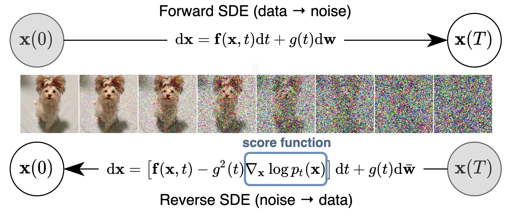
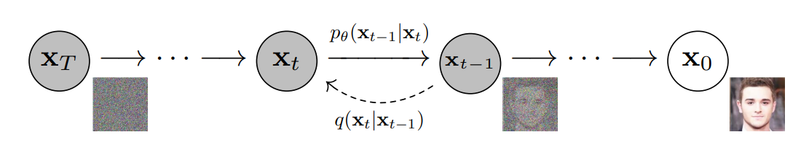
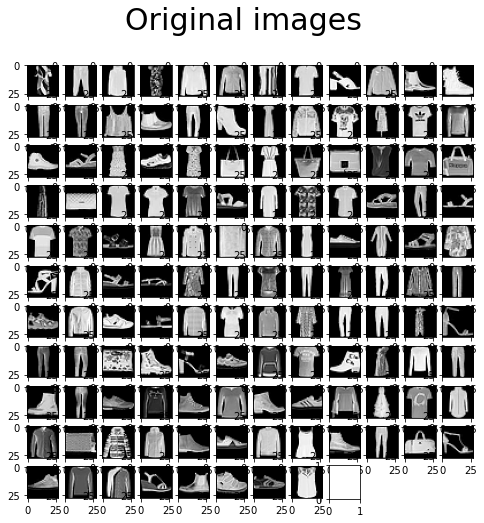
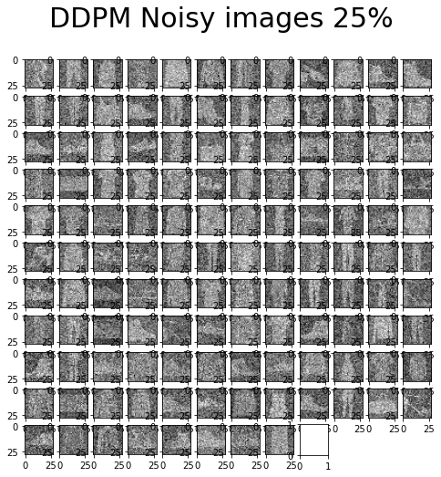
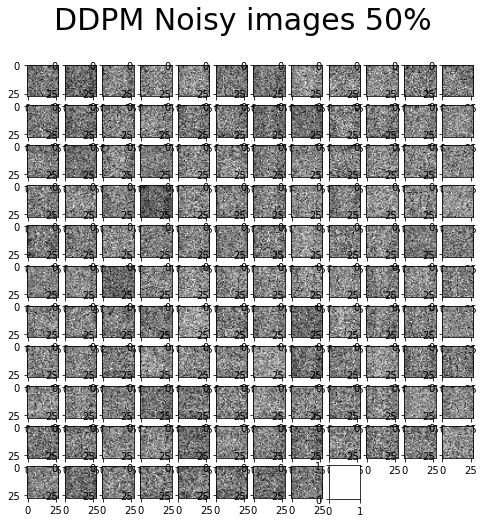
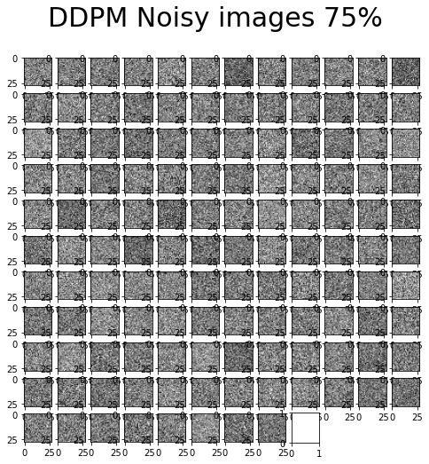
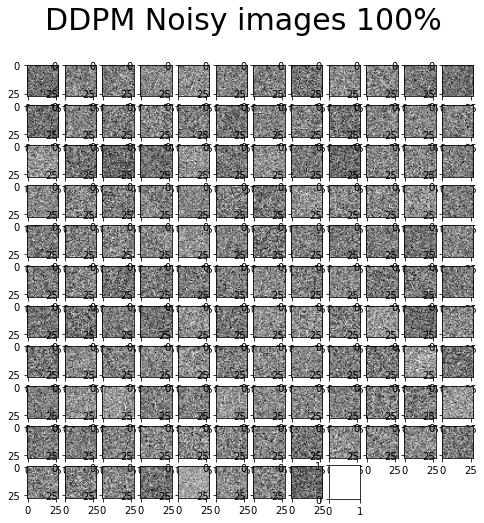

# Diffusion model

Diffusion models are the new state-of-art generative models that are used for image synthesis. They are called Denoise Diffusion Probabilistic Models (DDPMs) and are considered as score-based generative models. A score-based model is a type of model that makes predictions by generating a score or probability for each possible output class. These scores can then be used to rank the output classes and select the class with the highest score as the final prediction. Score-based models are often used in classification tasks, where the goal is to predict the class label of an input sample.
The main goal of these models is to generate/synthetize image from noise by reversing the process. We can define diffusion model as a parameterized Markov chain trained using
variational inference to produce samples matching the data after finite time.[[1]](/papers/Denoising%20Diffusion%20Probabilistic%20Models.pdf)

The learning process is composed of a forward stochastic differential equation (SDE) that consist in converting data(images) slowly into noise. Then we entend to reverse the diffusion process yields score-based generative models to found back the original data by starting with the noise. This is the the backward propagation part
## Detailled process
### Learning Process of a DDPM (Diffusion Models)

The learning process of a Diffusion Model (DDPM) consists of two phases:

- **Forward Diffusion Process ($q$):** During this phase, Gaussian noise is progressively added to the image until it becomes a "blurred" image.
- **Backward Diffusion Process ($p_\theta$):** In this backward process, we train our model to create or recover an image from a completely noisy image.
  
 

The noise addition process is divided into T steps, ranging from a noisy image at 100% to the original image at 0%. To enable the model to learn to reconstruct the images, a cost function needs to be introduced.

"Let $q(x_0)$ be the distribution of real data, such as 'real images.' We can sample from this distribution to obtain an image $x_0 \sim q(x_0)$. We define the forward process $q(x_t \mid x_{t-1})$, which adds Gaussian noise at each step $t$, according to a known sequence of variances $0 < \beta_1 < \beta_2 < ... < \beta_T < 1$.

$$
    q(x_t \mid x_{t-1}) = \mathcal{N}(x_t ; \sqrt{(1 - \beta_t)} x_{t-1}, \beta_t I)
$$

Now let's examine the backward process. We assume that the inverse process is also Gaussian, and any Gaussian distribution is defined by two parameters:

A mean parameterized by $(\mu_\theta)$
A variance parameterized by $(\Sigma_\theta)$
Thus, we can parameterize the process as follows:

$$
    p_\theta(x_{t-1} \mid x_t) = \mathcal{N}(x_{t-1} ; \mu_\theta(x_t, t), \Sigma_\theta(x_t, t))
$$

Here:

- $\mu_\theta(x_t, t)$ represents the mean parameter of the conditional probability distribution. It is modeled by the neural network and depends on the input $x_t$ and the time step $t$.
  
 

- $\Sigma_\theta(x_t, t)$ is the fixed variance parameter of the conditional probability distribution. Unlike the mean, it is not learned by the neural network and remains constant during training. It is also conditioned on the input $x_t$ and time step $t."
In the interest of simplifying explanations, we will simply say that the cost function is equivalent to the L2-loss function with respect to the mean:

$$
    L2_{\text{loss}}(\mu_p, \mu_q) = \frac{1}{2} \sum_{i=1}^k (\mu_q^{(i)} - \mu_p^{(i)})^2
$$

The final cost function $L_t$ for a random noise level $t$ given $\epsilon \sim \mathcal{N}(0, I)$ is as follows:

$$
    \| \epsilon - \epsilon_\theta(x_t,t)\|^2 =\|\epsilon - \epsilon_\theta(\sqrt{\bar{\alpha}_t}x_0 + \sqrt{1 - \bar{\alpha}_t}\epsilon, t)\|^2
$$

With:

- $x_0$ as the initial noisy image.
- $\epsilon$ as the 'pure' noise.
- $x_t$ as the image at time step $t$ obtained by the inverse diffusion process.
- $\epsilon (x_t,t)$ as the output of the neural network for the inverse diffusion step with image $x_t$.
- $\alpha_t := 1 - \beta_t$
- $\bar{\alpha}t := \prod{s=1}^t \alpha_s$.
  
 
Finally, the model is optimized using Mean Squared Error (MSE) between the predicted noise for time step t and the true noise at t. <a name="myfootnote2">2</a>: https://lilianweng.github.io/posts/2021-07-11-diffusion-models/

## Our Diffusion model

We will use a U-net architecture for our DDPM. The U-net is a specifical Neural Network  in U shape.(e.g)

The U-net will first "compress" the image and in a second will blow the image to it's original size. The particularity is that we skip some connection from the previous layer to laters ones in order to add spatial and context information to the final output. Our U-net is first design to take in input an 1x28x28 image. But as we tried later we can convert it for a different image format as 3x128x128.

First we add noises progressively to the original image allowing the model to learn from it.
It's the forward process of our U-Net. We use the MNIST-fashion dataset to test our model.

For our training we will use the Mean squared error as loss function. The classical MSE take the form:

 

$$
    MSE = Σ_{i=1}^n(Y_i - \hat{Y}_i)^2
$$

 

Where  $Y_i$ is the true value and $\hat{Y}_i$ the predicted value. In our case the the true value would be the a random noise $\epsilon$ and the predicted value will be $\epsilon_θ$. Where $\epsilon_θ$ is a function of $t$ the timestep and $x$ the image. The final equation become to minimise:

 

$$
||ϵ - ϵ_\theta(x_t,t)||^2=||\epsilon - \epsilon_\theta(\sqrt{\bar{\alpha}_t}x_0 + \sqrt{1 - \bar{\alpha}_t}\epsilon, t)||^2
$$

 
At each epoch we loop over the number of timestep.We add some noise for each of the images in the batch, a timestep and the respective alpha_bars. We compute the noisy image based on the loaded one and the time-step (forward process). We get the model to estimate the noise based on the images and the time-step. And the last part for that particular timestep, is to compute the MSE between the noise plugged and the predicted noise.

After training our model will be able to generate an image from random noises.

 

# Result

[2](#myfootnote2)

