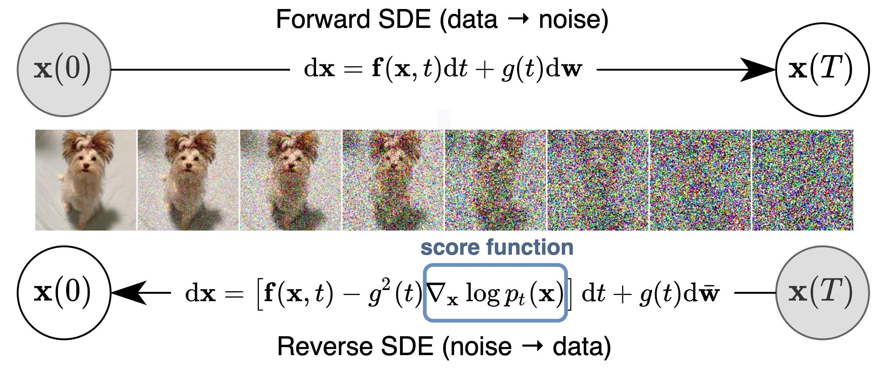

# Diffusion model

Diffusion models are the new state-of-art generative models that are used for image synthesis. They are called Denoise Diffusion Probabilistic Models (DDPMs) and are considered as score-based generative models.
The main goal of these models is to generate/synthetize image from noise by reversing the process. We can define diffusion model as a parameterized Markov chain trained using
variational inference to produce samples matching the data after finite time.[[1]](/papers/Denoising%20Diffusion%20Probabilistic%20Models.pdf)

The learning process is composed of a forward stochastic differential equation (SDE) that consist in converting data(images) slowly into noise. Then we entend to reverse the diffusion process yields score-based generative models to found back the original data by starting with the noise. This is the the backward propagation part
## Detailled process
###  Stochastic differential equation

In a first time, we need to specify an SDE that will the data distribution $p_0$ to a prior distribution  $p_T$. In a second time, we need to define the loss function. Now we just need to implement the forward propagation SDE and the reverse-time SDE. To solve the reverse-time SDE the Euler-Maruyama method is usually used.
[[2]](https://en.wikipedia.org/wiki/Euler%E2%80%93Maruyama_method)

## Our Diffusion model

To build my own difffusion model I will use the [hugging face](https://huggingface.co/docs/diffusers/api/pipelines/ddpm) library, their Denoising Diffusion Probabilistic Models are designed according to a novel connection between diffusion probabilistic models and denoising score matching with Langevin dynamics.

